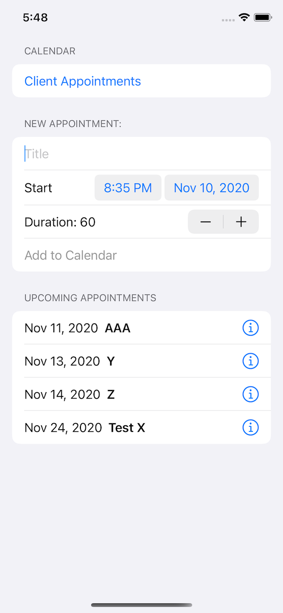

#  SharedCalendar

A simple prototype to test integration of the iOS calendar into a SwiftUI app.

## Features

- allow user to choose an existing or create a new calendar (using `EKCalendarChooser`)
- allow user create "appointments" with a custom title, start time and duration
- show the list of upcoming appointments
- show details for each appointment (using `EKEventViewController`)

## Screenshot

